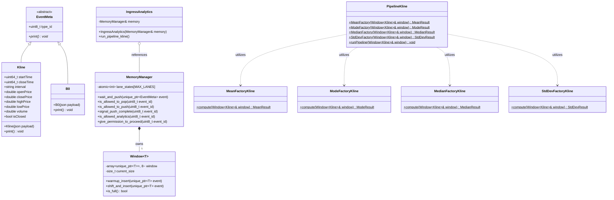
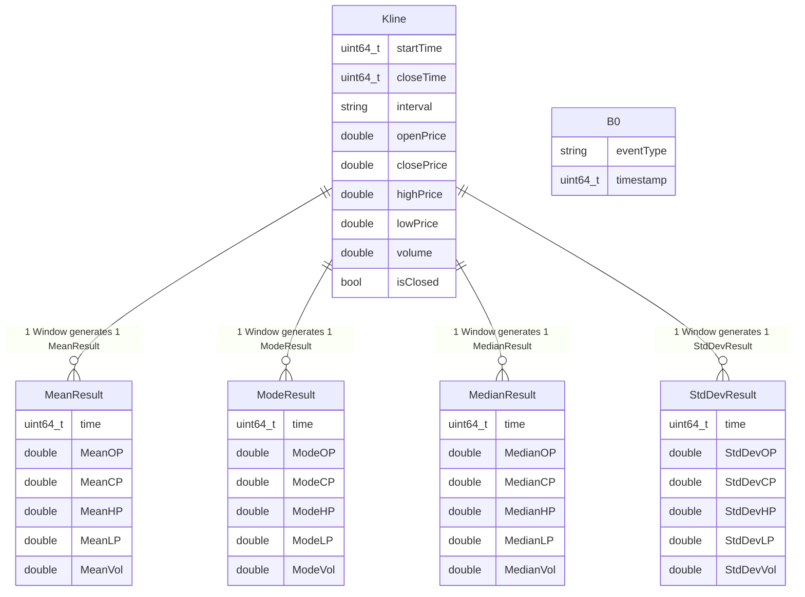
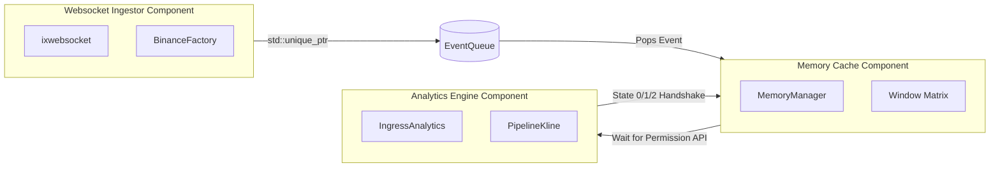
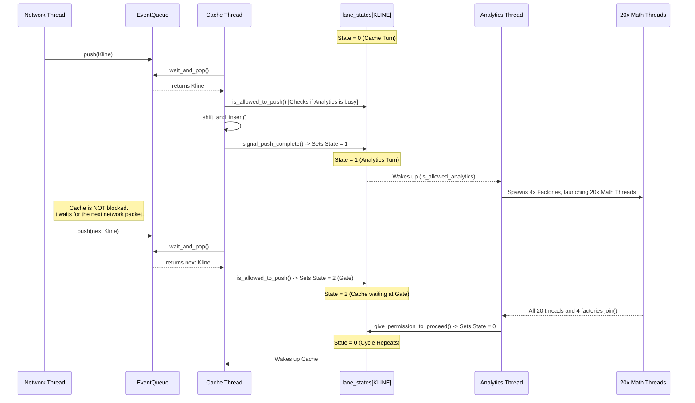
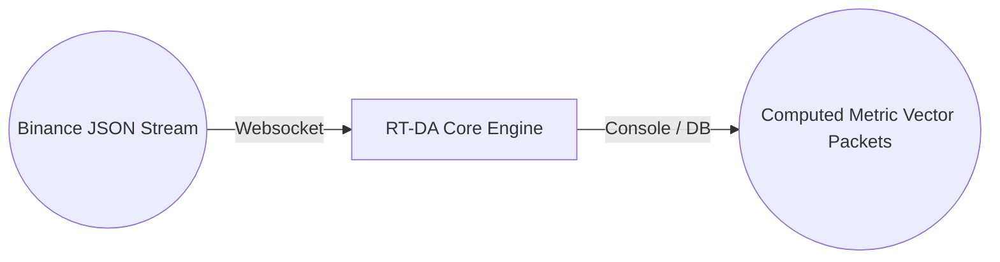
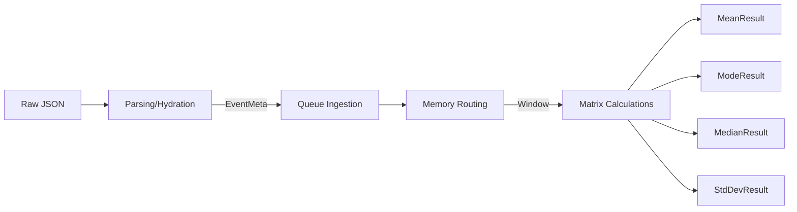
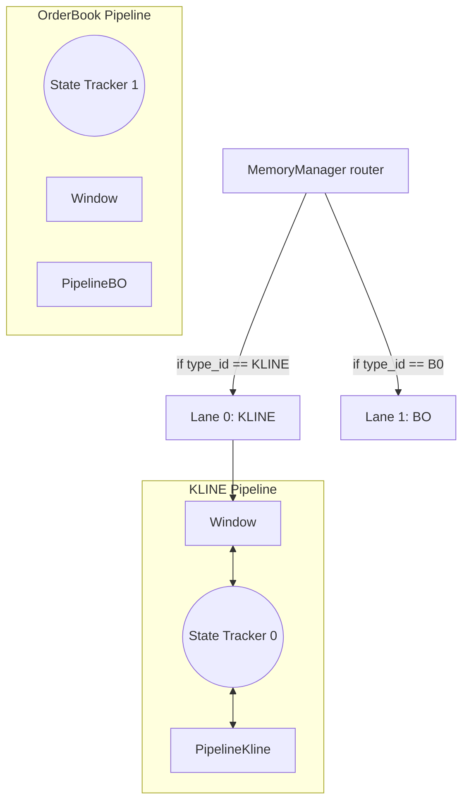
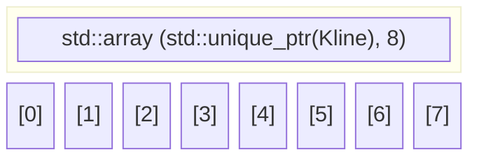

# RT-DA: Master Architecture & Diagrams

## 📋 The Master Diagram List

| Category | Diagram Type | Targeted Portfolio Purpose |
| --- | --- | --- |
| **Concurrency & Handshake** | 1. Concurrency Swimlane / Sequence Diagram | Tracks timeline/coordination across the 3 main threads and sub-workers. |
|  | 2. 3-State Finite State Machine (FSM) | Maps the exact $0 \rightarrow 1 \rightarrow 2 \rightarrow 0$ lock-free carousel transitions. |
| **Architectural Topology** | 3. UML Class Diagram | Displays inheritance (`EventMeta`), encapsulation, and composition relationships. |
|  | 4. Entity-Relationship Diagram (ERD) | Maps the physical data schema definitions (Klines, Order Books, Metrics). |
|  | 5. Component / Ball-and-Socket Diagram | Shows structural dependencies and clean interface boundaries. |
| **Data Flow (DFD)** | 6. DFD Level-0: Context Diagram | Illustrates how the engine treats external WebSocket inputs and console outputs. |
|  | 7. DFD Level-1: Processing Pipeline | Tracks memory transformations from raw JSON bytes down to `Window` memory. |
|  | 8. DFD Level-2: Multi-Lane Routing | Shows the isolated parallel execution lanes inside the `MemoryManager`. |
| **Hardware & Performance** | 9. Memory Layout & Cache Alignment | Displays pointer displacement mechanics (`std::move`) in cache lines. |

---

## 🏛️ Comprehensive Structural Breakdowns

### 1. UML Class Diagram

This captures the object-oriented structure of your C++ engine. It visually proves your separation of concerns and type safety to architects reading your portfolio.

### 2. Entity-Relationship Diagram (ERD)

Even though you are using high-speed in-memory structures rather than a standard relational SQL database, an ERD is vital to define your data models.

### 3. Component Diagram (Ball-and-Socket)

This presents your modular software engineering patterns.

### 4. Concurrency Swimlane / Sequence Diagram

This maps execution across horizontal hardware layout lanes, tracking the $0 \rightarrow 1 \rightarrow 2 \rightarrow 0$ synchronization over time.

### 5. DFD Levels (Context down to Multi-Lane Execution)

**Level 0: Context Diagram**

**Level 1: Processing Pipeline**

**Level 2: Multi-Lane Routing**

### 6. Memory Layout & Cache Alignment Diagram

Demonstrates systems programming awareness and CPU Cache Line efficiency.

> **Systems Optimization Sidebar:**
> When `shift_and_insert()` is called, the CPU is NOT copying heavy 80+ byte `Kline` data structs around memory. It is purely performing `std::move` on 8-byte heap pointer addresses (`std::unique_ptr`). Because the contiguous `std::array` of 8 pointers spans exactly 64 bytes, it fits perfectly inside a single **L1/L2 CPU Cache Line**. This ensures hardware-level memory bank fetches are kept to an absolute minimum, bypassing expensive RAM lookups.
