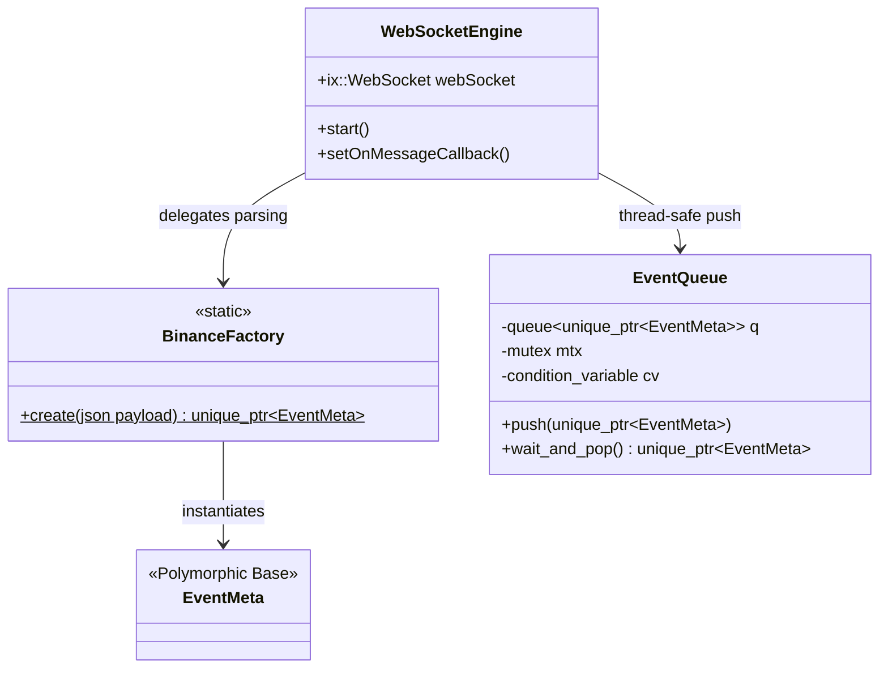
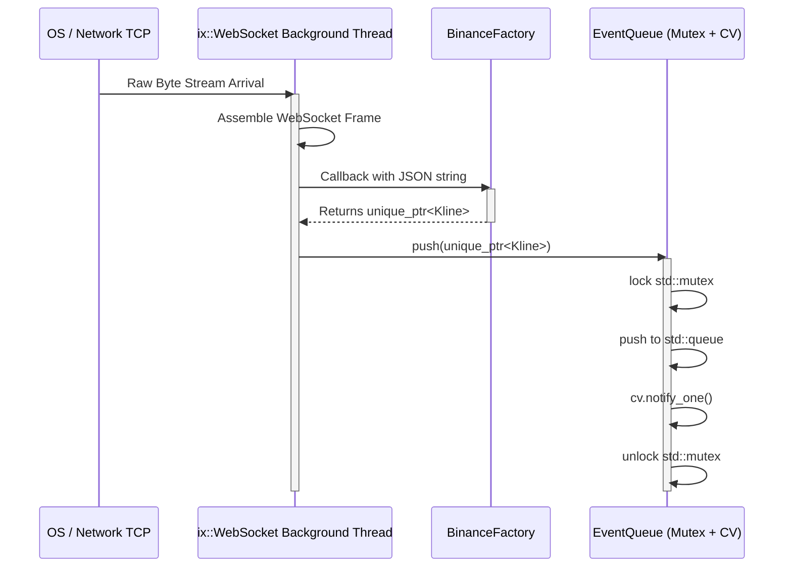
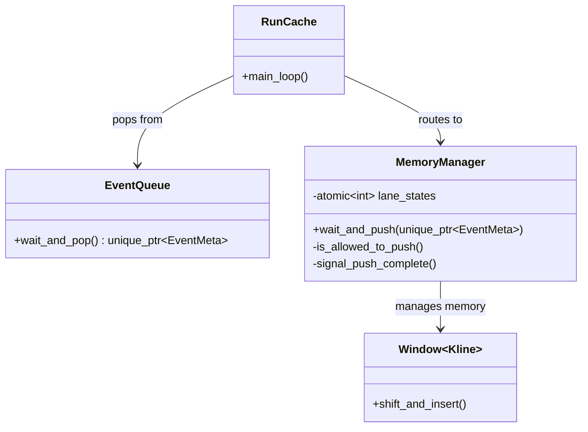
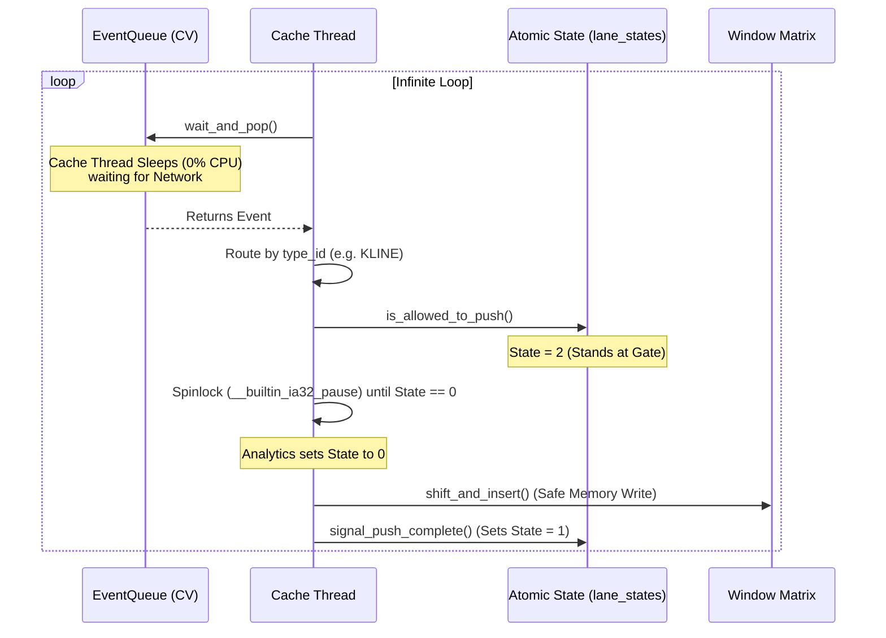
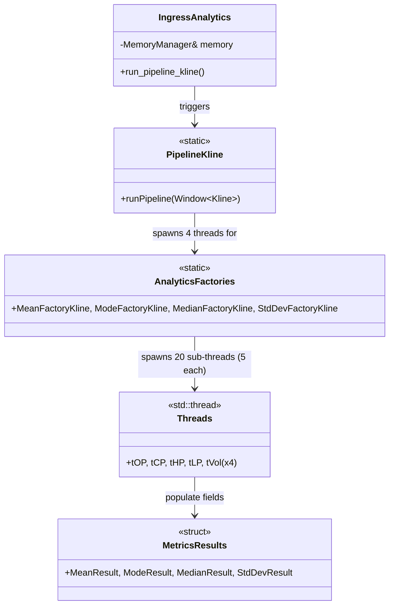
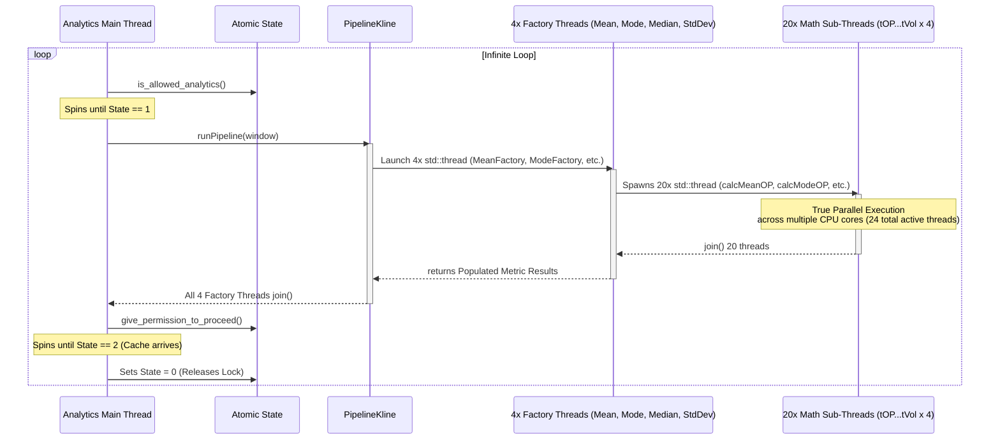

# RT-DA: Deep Dive - Thread Mechanics & Concurrency

This document breaks down the specific concurrency models, thread lifecycles, and class topologies for the three distinct domains of the RT-DA pipeline: **Ingestor**, **Cache**, and **Analytics**.

---

## 1. The Ingestor Domain (Network & Queueing)

The Ingestor domain is responsible for asynchronous network I/O, JSON parsing, and safely crossing the boundary from the network to the internal application queue.

### Class Diagram

### Concurrency Sequence (How the Threads Work)
The `ixwebsocket` library runs its own internal background thread to listen to the TCP socket. When a packet arrives, it fires a callback into our application space, which we parse and push into a mutex-locked queue.

---

## 2. The Cache Domain (Memory Router)

The Cache thread acts as the ultimate decoupled relayer. It bridges the slow, blocking network queue with the ultra-fast, lock-free analytics matrix.

### Class Diagram

### Concurrency Sequence (How the Threads Work)
The Cache thread loops infinitely. It sleeps with 0% CPU usage while waiting for network packets. Once a packet arrives, it dynamically routes it. If the memory matrix is full, it switches to spin-lock atomics to negotiate safe memory access with the Analytics Engine.

---

## 3. The Analytics Domain (Math Engine & Fan-Out)

The Analytics domain is the heaviest CPU consumer. It is designed to sit idle, wake up upon a memory update, and aggressively fan out its mathematical operations across multiple sub-threads to maximize hardware utilization.

### Class Diagram

### Concurrency Sequence (How the Threads Work)
This is where the massive multi-threading takes place. The main Analytics thread waits for State 1. Once triggered, it launches 4 dedicated Factory Threads (Mean, Mode, Median, StdDev). Each of these factories then launches 5 Math Sub-Threads for parallel calculations (OP, CP, HP, LP, Vol). All 20 threads compute in parallel, join back together, and return their respective metric structs.

